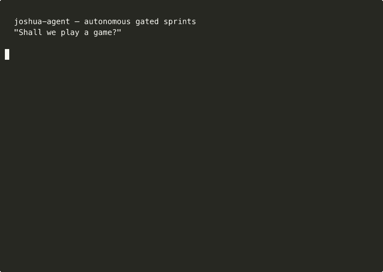

# joshua-agent

**Autonomous gated software sprints.**

| Signal | Status |
| --- | --- |
| Package | `1.12.0` |
| Tests | `353 pytest tests`; CI runs on Python `3.11`, `3.12`, `3.13` |
| Release path | GitHub Actions CI + PyPI publish workflow |

## Demo



*Real execution: 2 cycles — Cycle 1 GO (deploy), Cycle 2 REVERT (rollback). [asciinema recording](assets/demo.cast)*

Define your team in YAML. Agents work in cycles — dev, bug-hunter, QA. The gate decides:  deploys.  rolls back. You come back to a log.

*One day, teams will stop babysitting AI. Instead of prompting one agent at a time — copy, paste, check, repeat — they'll define a team in a YAML file and walk away. The agents run in cycles: execute tasks, review each other, deploy or roll back, extract lessons, sleep, repeat. You come back to a log of what happened and (hopefully) better output than yesterday. — @jorgevazquez, April 2026*

Built for software delivery. Each cycle: work agents write and fix code, a gate agent reviews and issues a verdict.  → deploy.  → continue carefully.  → roll back via git. Lessons accumulate, a wiki builds itself, future prompts get sharper. Extensible to any domain — document review, compliance, financial analysis — once you understand the core loop.

Named after the AI in WarGames that learned the only winning move is to keep playing.

```

## Current status

**Stable**

- YAML-defined multi-agent sprints with `work` and `gate` phases
- `GO` / `CAUTION` / `REVERT` verdict loop with snapshot or hillclimb git strategies
- CLI workflow: `joshua run`, `joshua status`, `joshua doctor`, `joshua init`, `joshua examples`, `joshua explain`, `joshua tutorial`, `joshua evolve`, `joshua serve`, and more
- HTTP control plane, process-based runtime, persistence, notifications, and restart recovery
- Safety config with command/path allowlists, protected files, objective metrics, and explicit verdict policy wiring

**Experimental**

- Unattended live deploys on real production infrastructure
- Self-learning wiki quality and prompt evolution across long-running sprints
- Event-driven and on-demand modes that depend on custom task sources and hooks
- Custom runners and hook chains that execute arbitrary shell commands
 Work Skills              Gate Skills
+--------------+          +----------+
| Dev          |          |          |
| Bug Hunter   |--------->|   QA     |--> Deploy (or Revert)
| CFO          |          | Review   |
| Any Skill... |          +----------+
+--------------+               |
       ^                       |
       +---- next cycle -------+
```

## How it works

joshua-agent has three core concepts:

- **Skills** — a skill is any professional role you can describe in a prompt. `dev`, `qa`, `bug-hunter`, `security`, `cfo`, `legal-analyst`, `compliance`, `pm`, `tech-writer`, or literally anything else. Built-in skills are just prompt templates. You can define your own with `system_prompt:` in YAML — if you can brief a human, you can brief an agent.
- **Phases** — agents are either `work` (execute tasks) or `gate` (review and judge). Work agents produce output. Gate agents read that output and return a verdict: `GO` (ship it), `CAUTION` (ship but flag), or `REVERT` (roll back). This separation exists because unsupervised AI output is dangerous. The gate is a circuit breaker.
- **Cycles** — agents don't run once. They cycle. Each cycle picks the next task (round-robin), runs all work agents, feeds the output to gate agents, acts on the verdict, extracts lessons, and sleeps. Then does it again. This is how real teams work — continuous improvement, not heroic one-off efforts.

The runner abstraction means joshua-agent doesn't care what LLM you use. Claude Code, OpenAI Codex, Aider, or any CLI tool. Swap it in the YAML and everything else stays the same.


## Metrics & Evaluation

Each sprint cycle, joshua tracks:

- **Cycle number** — sequential counter since the sprint started
- **Agent durations** — wall-clock seconds each agent took to run
- **Gate verdict** — `GO`, `CAUTION`, or `REVERT` for the cycle
- **Consecutive errors** — how many cycles in a row ended in failure or error
- **Gate findings** — the raw text the gate agent returned, injected into the next cycle

Results are stored in the `.joshua/` directory alongside your project:

```
.joshua/
├── checkpoint.json     Current cycle number, last verdict, error counts
├── results.tsv         One row per cycle — verdict, duration, confidence, description
├── cycles/             Per-cycle Markdown summaries + raw outputs (for replay)
│   ├── cycle-0001.md   Human-readable summary: verdict, cost, gate findings
│   └── cycle-0001.json Raw work-agent outputs (used by `joshua replay`)
├── events/             Structured JSON events per cycle
├── lessons/            One file per cycle — raw lessons extracted from agent output
└── wiki/               Curated knowledge entries built from accumulated lessons
```

To measure progress across cycles, use the status command:

```bash
joshua status .joshua
```

This shows cycle history, verdict distribution, and per-agent timing. Compare cycle 1 vs cycle N to see whether the gate is issuing fewer REVERTs and agents are completing tasks faster.

To evolve agent prompts using accumulated lessons:

```bash
joshua evolve config.yaml
```

`joshua evolve` curates raw lessons into wiki entries and can rewrite agent prompts to incorporate what was learned.

**Honest note:** There is no public benchmark dataset for joshua-agent. What you can track concretely on your own project: GO/REVERT ratio over time, cycle-over-cycle agent duration, and gate finding patterns. Use `joshua status` to build your own baseline.

## Quick start

```bash
pip install joshua-agent
```

## Docker

```bash
# Run a sprint in Docker
docker run --rm -v $(pwd):/workspace \
  -e ANTHROPIC_API_KEY=$ANTHROPIC_API_KEY \
  ghcr.io/jorgevazquez-vagojo/joshua-agent \
  run sprint.yaml

# Full stack (server + Redis)
docker compose up
```

See `docker-compose.yaml` and `.env.example` for configuration.

**Example 1 — Safe-by-default development sprint.** Start with a wrapper script you control. Keep build, tests, migrations, and health checks inside that script instead of wiring ad hoc shell directly into the first demo.

```yaml
# dev-sprint.yaml
project:
  name: my-app
  path: ~/my-app
  deploy: "./deploy.sh"   # Start here: keep deploy logic behind one script you own

agents:
  dev:
    skill: dev
    tasks:
      - "Review code quality and suggest improvements"
      - "Refactor for maintainability"
  bug-hunter:
    skill: bug-hunter
    tasks:
      - "Scan for uncaught exceptions and error handling gaps"
  qa:
    skill: qa

sprint:
  cycle_sleep: 600
```

Use a wrapper for deploys. It keeps the first sprint reproducible and makes it much easier to add tests, health checks, migrations, or rollback hooks without rewriting the YAML.

**Example 2 — Executive sprint.** No code. No deploy command. Agents analyze documents, audit costs, and check compliance. Same framework, different skills.

```yaml
# executive.yaml
project:
  name: acme-corp
  path: ~/acme-corp-docs

agents:
  cfo:
    skill: cfo
    system_prompt: |
      You are {agent_name}, CFO for {project_name}.
      Analyze financial documents in {project_dir}.
    tasks:
      - "Audit vendor contracts expiring within 90 days"
      - "Analyze monthly burn rate from financial reports"
  compliance:
    skill: compliance
    phase: gate
    verdict_format: true
    system_prompt: |
      You are {agent_name}, Compliance Director.
      Review all analysis for regulatory compliance.

sprint:
  cycle_sleep: 600
  gate_blocking: true
```

```bash
joshua run dev-sprint.yaml    # Software sprint
joshua run executive.yaml     # Business analysis sprint
```

Agents work, gate reviews, act on verdict. Repeat. Any domain, any role.

### What it looks like

```
============================================================
CYCLE 1 — 2026-04-05T03:14:00
============================================================
[cfo] (cfo) Task: Audit vendor contracts expiring within 90 days
[cfo] OK (189.3s, 3841 chars)
[compliance] (compliance) Reviewing cycle 1...
[compliance] OK (94.2s, 1102 chars)
VERDICT: GO
CYCLE 1 COMPLETE — verdict=GO
Sleeping 600s before next cycle...
```

## Design choices

**Skills, not roles.** Every agent is a skill defined in YAML. Built-in skills (`dev`, `qa`, `bug-hunter`, `security`, `perf`, `pm`, `tech-writer`) are convenient starting points — just prompt templates with sensible defaults. But the real power is custom skills: a CFO that audits costs, a legal analyst that reviews contracts, a compliance officer that checks governance, a COO that maps operational bottlenecks. No deploy command needed. No code required. joshua-agent is not a coding tool that happens to support other things. It's a framework for autonomous professional work that happens to be good at code too.

**Two phases: work and gate.** Work agents do the job. Gate agents judge it. This is the single most important design decision in the framework. Without a gate, you're just running unsupervised AI and hoping for the best. The gate is a circuit breaker — `REVERT` means nothing ships. In production, we've seen gate agents catch issues that would have broken deployments, flagged non-compliant analysis, and prevented cascading errors. The two-phase model also means you can scale work agents independently of review capacity.

**Continuous cycles, not one-shot.** Most agent frameworks run once and stop. joshua-agent cycles. Each cycle picks the next task from a round-robin queue, so a dev agent with 10 tasks will work through all of them across 10 cycles. After each cycle, agents extract lessons from their output. What worked, what broke, what patterns to follow or avoid. These lessons accumulate and get injected into future prompts. The agents literally get better over time. We've observed measurable improvement in output quality between cycle 1 and cycle 10 on the same project.

**Self-learning via wiki (Karpa pattern).** Raw agent output from every cycle gets saved. Periodically, the LLM curates this raw output into structured knowledge entries — a wiki that builds itself. Entries get deduplicated, lint-checked for contradictions, and fed back to agents as context. You never write the wiki. The LLM writes everything. You just steer — every answer compounds into institutional knowledge.

**LLM-agnostic.** joshua-agent talks to CLI tools, not APIs. Claude Code, OpenAI Codex, Aider, or any custom command that accepts a prompt and returns text. The runner is a one-method interface: `run(prompt, cwd, system_prompt, timeout) -> RunResult`. Swap it in YAML, everything else stays the same. This means you can use different models for different agents — Opus for the gate, Sonnet for work agents, a local model for experiments.

**Gate blocking.** When a gate says `REVERT`, you probably don't want work agents piling more changes on top. `gate_blocking: true` freezes work agents on the next cycle. Only agents marked `run_when_blocked: true` (like bug hunters and security scanners) will run. This prevents compounding failures — the bug hunter fixes what the gate flagged, the gate reviews the fix, and only then does normal work resume.

**Cross-agent context.** Gate findings from the previous cycle get injected into work agents' prompts via `{gate_findings}`. The QA agent tells the dev agent what's wrong. The dev agent fixes it next cycle. They talk through the framework — no manual copy-paste, no context loss between runs.

**Resource-aware scheduling.** Each LLM agent consumes significant memory. Running multiple sprints on the same machine can trigger OOM kills (we learned this the hard way). `min_memory_gb` checks available RAM before each agent run — if memory is low, joshua-agent waits instead of crashing. `agent_stagger` adds a fixed delay between agent executions to let the system breathe. Together, they let you safely run multiple sprints on a single server.

**Objective metrics.** Gate agents are good at qualitative review, but they can't replace a test suite. `project.objective_metric` defines a shell command that returns a number (lower is better). joshua-agent runs it before and after work agents, injects the delta into the gate prompt, and logs both values to `results.tsv`. The gate agent now has hard data alongside its qualitative judgment. Think `pytest --tb=no -q`, a benchmark script, or any command that outputs a number.

**Protected files.** `project.protected_files` lists globs that work agents must not modify. The instruction is injected directly into the task prompt: "DO NOT modify: tests/\*\*, eval.py". This prevents agents from "gaming" the metric by editing the evaluation or test harness — the same pattern Karpathy uses in autoresearch where `prepare.py` is read-only.

**Hillclimb git strategy.** `git_strategy: hillclimb` turns git into a hill-climbing checkpoint. Before each cycle, joshua-agent commits the current state. After work agents run and the gate reviews, a `REVERT` verdict triggers `git reset --hard` to the checkpoint. A `GO` verdict keeps the commit. The result: every surviving commit in git history is a verified improvement. Compare with `snapshot`, which creates branches per cycle — hillclimb is simpler and produces a linear history.

**Three trigger modes.** `sprint.trigger` controls when cycles run. `continuous` (default) runs cycles back-to-back with `cycle_sleep` between them — good for proactive improvement. `event` polls task sources (Jira, GitHub) every `poll_interval` seconds and only runs a cycle when there's real work — no tasks, no Claude calls, no tokens burned. `on_demand` waits for an external trigger via the API (`trigger_cycle()`) — useful for CI/CD integration where a deploy or PR event kicks off a review.

## Supported runners

| Runner | Command | Install |
|--------|---------|---------|
| **Claude Code** | `claude` | `npm i -g @anthropic-ai/claude-code` |
| **OpenAI Codex** | `codex` | `npm i -g @openai/codex` |
| **Aider** | `aider` | `pip install aider-chat` |
| **Custom** | any CLI | `command: "my-tool --input {prompt_file} --dir {cwd}"` |

## Full config reference

```yaml
project:
  name: my-project
  path: ~/my-project                # Any folder — code, docs, reports, data
  deploy: "bash deploy.sh"          # Optional — omit for non-code sprints
  health_url: http://localhost:3000/health  # Optional
  objective_metric: "pytest --tb=no -q | tail -1"  # Command that prints a number (lower = better)
  protected_files:                  # Globs agents must NOT modify
    - "tests/**"
    - "eval.py"

program: |                          # Optional — shared context for ALL agents
  ## Objective
  Reduce p95 latency below 200ms.
  ## Constraints
  - Do NOT modify database schema
  - Only edit files in src/api/

runner:
  type: claude                  # claude | codex | aider | custom
  timeout: 1800                 # Max seconds per agent run
  model: sonnet                 # Model override (optional)

agents:
  dev:
    name: falken                # Custom name (optional)
    skill: dev                  # Built-in or custom skill
    max_changes: 5              # Max changes per cycle
    run_when_blocked: false     # Run even when gate is blocked
    tasks:
      - "Task 1"
      - "Task 2"               # Round-robin through list

  qa:
    skill: qa                   # Gate skills auto-detect verdict format

  cfo:
    skill: cfo
    system_prompt: |            # Any prompt you want
      You are {agent_name}, a CFO reviewing {project_name}.
      Analyze costs, licensing, and resource usage.
    tasks:
      - "Audit third-party dependency costs"

sprint:
  trigger: continuous           # continuous | event | on_demand
  poll_interval: 300            # Seconds between polls (event/on_demand modes)
  cycle_sleep: 300              # Seconds between cycles
  max_cycles: 0                 # 0 = infinite
  max_hours: 96                 # 0 = infinite
  digest_every: 12              # Summary report every N cycles
  retries: 2                    # Retry failed agent runs
  revert_sleep: 600             # Longer sleep after REVERT
  max_consecutive_errors: 5     # Stop after N errors in a row
  gate_blocking: true           # REVERT blocks work agents
  cross_agent_context: true     # Gate findings -> work agents
  health_check: true            # Check health_url each cycle
  recovery_deploy: "bash rollback.sh"
  git_strategy: hillclimb       # none | snapshot | hillclimb
  agent_stagger: 30             # Seconds to wait between agent runs
  min_memory_gb: 4              # Wait for free RAM before each agent

preflight:
  min_disk_gb: 5                # Check disk before each cycle
  min_memory_gb: 4              # Check RAM before each cycle
  memory_wait_timeout: 120      # Seconds to wait if memory is low
  docker_cleanup: true          # Auto-clean Docker on low disk

notifications:
  type: telegram                # telegram | slack | webhook | none
  token: ${TELEGRAM_TOKEN}
  chat_id: ${TELEGRAM_CHAT_ID}

tracker:
  type: jira                    # jira | github | filesystem | none
  base_url: https://x.atlassian.net
  project_key: PROJ

memory:
  enabled: true
  state_dir: .joshua
  max_lesson_age_cycles: 50     # Filter lessons older than N cycles from prompts

runner:
  max_tokens_per_cycle: 50000   # Stop adding work agents if estimated tokens exceed this (0 = off)
```

### Dynamic task sources

Agents can pull tasks from external systems instead of a static YAML list:

```yaml
agents:
  dev:
    skill: dev
    task_source: github           # or: jira | gate
    task_source_config:
      repo: acme/backend          # owner/repo
      token: ${GITHUB_TOKEN}      # optional — for private repos / higher rate limit
      labels: "bug,help wanted"   # optional label filter
      max_results: 20             # issues to consider per cycle

  qa:
    skill: qa
    task_source: jira
    task_source_config:
      base_url: https://company.atlassian.net
      user: ${JIRA_USER}
      token: ${JIRA_TOKEN}
      jql: "project = PROJ AND type = Bug AND resolution = Unresolved"

  fixer:
    skill: dev
    task_source: gate             # Use top issue from last gate findings as task
```

| Source | Description |
|--------|-------------|
| `github` | Open issues from a GitHub repo (filters out PRs, round-robin by cycle) |
| `jira` | Issues from a Jira JQL query (requires HTTPS) |
| `gate` | Generates task from last gate verdict's top finding (REVERT/CAUTION → resolves issues) |

Template variables available in agent prompts: `{agent_name}`, `{skill}`, `{project_name}`, `{project_dir}`, `{deploy_command}` (from `project.deploy`), `{program}` (from top-level `program:`), `{memory}`, `{wiki}`, `{gate_findings}`, `{max_changes}`.

Each cycle appends one row to `.joshua/results.tsv` — a greppable, diffable log that doesn't need the CLI:

```
cycle  verdict  duration_s  agents          confidence  metric_before  metric_after  description
1      GO       284.1       dev,bug-hunter  0.94        12.3           8.1           Fixed SQL injection...
2      REVERT   312.0       dev,qa          0.97        8.1            15.2          Auth middleware broke...
```

## CLI

### Onboarding

```bash
joshua tutorial                         # Simulated sprint walkthrough — no API key needed
joshua examples                         # List all built-in example configs with descriptions
joshua examples python-api              # Copy a template to current directory
joshua examples python-api --show       # Print template contents
joshua init                             # Interactive setup wizard
joshua init --template minimal          # Start from a built-in template
joshua schema > joshua-schema.json      # Export JSON Schema for IDE YAML autocomplete
joshua explain config.yaml              # Human-readable sprint plan + cost estimate
joshua doctor config.yaml               # Pre-flight checks (Python, runner, git, path, creds)
```

### Running

```bash
joshua run config.yaml                  # Run a sprint
joshua run config.yaml -n 10            # Max 10 cycles
joshua run config.yaml -H 96            # Max 96 hours
joshua run config.yaml --dry-run        # Validate config only
joshua run config.yaml --agents dev,qa  # Run only specific agents
```

### Monitoring

```bash
joshua status .joshua                   # Status dashboard
joshua status .joshua --watch           # Live-refresh dashboard (Ctrl+C to stop)
joshua status .joshua --json            # Machine-readable JSON (for CI: | jq .checkpoint.cycle)
joshua logs .joshua                     # Print last 50 log lines
joshua logs .joshua --follow            # Live tail (like tail -f)
```

### Analysis & export

```bash
joshua replay config.yaml --cycle 7    # Re-run gate on saved cycle output (no work agents)
joshua export .joshua                   # Sprint report as Markdown (stdout)
joshua export .joshua --format json     # Sprint report as JSON
joshua export .joshua --cycles 5        # Last 5 cycles only
joshua diff .joshua --cycle 3 --cycle 7 # Compare two cycles side by side (verdict, confidence, findings diff)
joshua diff .joshua                     # Compare last two cycles
joshua distill .joshua1 .joshua2        # Consolidate lessons across multiple sprints
```

### Environment comparison

```bash
joshua compare dev.yaml pre.yaml pro.yaml           # Compare existing results side by side
joshua compare dev.yaml pre.yaml pro.yaml --run      # Run one QA cycle first, then compare
joshua compare dev.yaml pre.yaml pro.yaml --run --parallel  # Run all envs concurrently
joshua compare dev.yaml pre.yaml pro.yaml -f markdown       # GFM table (for reports, Jira, etc.)
joshua compare dev.yaml pre.yaml pro.yaml -f json           # JSON output (for CI/dashboards)
joshua compare dev.yaml pre.yaml pro.yaml -o report.md -f markdown  # Save to file
joshua compare dev.yaml pre.yaml pro.yaml -f markdown -e client@example.com  # Email report
```

`compare` reads `.joshua/checkpoint.json` and `.joshua/results.tsv` from each config's state directory and renders a side-by-side verdict matrix. The first environment is the **baseline** — regressions against it are flagged automatically.

**Example output (`--format table`):**

```
Environment comparison — 2026-04-08 14:55
──────────────────────────────────────────────────────────────────────────────
Environment    Verdict          Cycle   Conf  Dur(s)  vs base   Top finding
──────────────────────────────────────────────────────────────────────────────
dev            ✓  GO              12   0.92   142.3  =          Auth fix deployed OK
pre            ⚠  CAUTION          9   0.71   189.1  ▼ worse    DB pool size warning
pro            ✗  REVERT           7   0.97     —    ▼ worse    SQL injection in /search
──────────────────────────────────────────────────────────────────────────────
→ REVERT in one or more environments — block promotion
```

Column reference:

| Column | Description |
|--------|-------------|
| `Environment` | Config filename (without `.yaml`) |
| `Verdict` | Last gate verdict from `checkpoint.json` |
| `Cycle` | Cycle number when verdict was issued |
| `Conf` | Gate confidence score (0–1) |
| `Dur(s)` | Average cycle duration in seconds |
| `vs base` | Regression vs first environment (`=` same · `▲ better` · `▼ worse`) |
| `Top finding` | First line of last gate findings |

Summary line logic:

| Condition | Summary |
|-----------|---------|
| All envs GO | `→ All environments GO — ready to promote` |
| Any REVERT | `→ REVERT in one or more environments — block promotion` |
| Any CAUTION, no REVERT | `→ CAUTION in one or more environments — review before promoting` |

### Release flow

```bash
joshua promote dev.yaml pre.yaml pro.yaml           # Promote all envs in sequence if all GO
joshua promote dev.yaml pre.yaml pro.yaml --dry-run # Show what would be deployed
joshua promote dev.yaml pre.yaml pro.yaml --force   # Skip gate verification between envs
joshua rollback dev.yaml                            # Git rollback to last snapshot SHA
joshua rollback dev.yaml --to HEAD~1                # Rollback to specific git ref
joshua rollback dev.yaml --dry-run                  # Show before/after SHA without rolling back
```

### Skills

```bash
joshua skill list                       # List all built-in skills with descriptions
joshua skill new                        # Interactive wizard to create a custom skill
```

Custom skills are saved to `~/.joshua/skills/<name>.yaml` and available in any config with `skill: <name>`.

### Automation

```bash
joshua fleet fleet.yaml                 # Run multiple projects from a YAML list
joshua fleet fleet.yaml --dry-run       # Preview without running
joshua schedule config.yaml --interval 3600         # Run QA every 1 hour
joshua schedule config.yaml --cron "0 8 * * 1-5"   # Print crontab command for 8am Mon-Fri
joshua schedule config.yaml --dry-run               # Show next 5 run times
joshua serve                            # Start HTTP control plane (default: 127.0.0.1:8100)
joshua serve --cert-file c.pem --key-file k.pem  # HTTPS
joshua evolve config.yaml              # Run evolution + wiki maintenance
joshua completion bash >> ~/.bashrc     # Shell completion (bash/zsh/fish)
```

> **Deploy safety**: `project.deploy` runs as a shell command with your user's permissions. Shell metacharacters (`;`, `|`, `` ` ``, `$(`) are rejected by config validation. Use dry-run mode (`joshua run config.yaml --dry-run`) to validate before running. Never use untrusted YAML configs.

## Examples

See [`examples/`](examples/) for ready-to-use configs:

**Business & governance:**
- [`executive-team.yaml`](examples/executive-team.yaml) — CFO + COO + Compliance Director
- [`legal-review.yaml`](examples/legal-review.yaml) — Legal Analyst + Risk Assessor + General Counsel

**Software development:**
- [`minimal.yaml`](examples/minimal.yaml) — 3 agents, zero config
- [`full-team.yaml`](examples/full-team.yaml) — Dev, Bug Hunter, Security, Perf, PM, QA
- [`wordpress.yaml`](examples/wordpress.yaml) — WordPress: WCAG, SEO, PHP audits
- [`nextjs.yaml`](examples/nextjs.yaml) — Next.js: TypeScript, React, API audits
- [`python-api.yaml`](examples/python-api.yaml) — FastAPI/Django: testing, security, DB audits

## Use Cases

Three ready-to-run packs for common scenarios:

### Pack 1: Legacy Modernization

Agents: `dev` (modernize code), `bug-hunter` (find regressions), `qa` (gate review).
Each cycle improves one area of a legacy codebase. The gate blocks the next cycle if tests break or regressions appear, so changes accumulate safely. Example: [`examples/python-api.yaml`](examples/python-api.yaml).

### Pack 2: Continuous Release Gate

Agents: `dev` (implement feature or fix), `qa` (quality gate with GO/CAUTION/REVERT).
Runs your CI-equivalent autonomously — auto-deploys on GO, reverts on REVERT, sleeps and repeats. Drop-in replacement for a human code reviewer on low-risk branches. Example: [`examples/minimal.yaml`](examples/minimal.yaml).

### Pack 3: Document & Compliance Review

Agents: `analyst` (review documents), `legal` (compliance check), `executive` (summary + gate).
Multi-agent review cycle for contracts, policies, or technical specs. No deploy command needed — the gate verdict determines whether the document passes or requires revision. Example: [`examples/legal-review.yaml`](examples/legal-review.yaml).

### Pack 4: Client QA Across Environments (DEV / PRE / PRO)

Ideal for agencies running QA as a service on behalf of a client. Each environment gets its own config file. Runs are point-in-time (one review cycle, not continuous) triggered by your CI pipeline or manually before a release.

**Setup — one config per environment:**

```yaml
# dev.yaml
project:
  name: client-app-dev
  path: ~/client-app
  health_url: https://dev.client.com/health
  objective_metric: "pytest tests/smoke/ --tb=no -q | tail -1"

agents:
  researcher:
    skill: dev
    system_prompt: |
      You are a QA analyst reviewing the DEV environment of {project_name}.
      Check for functional regressions, broken flows, and performance issues.
    tasks:
      - "Audit all critical user flows and flag any regressions"
  qa:
    skill: qa
    phase: gate
    verdict_format: true

sprint:
  trigger: on_demand       # Only runs when explicitly triggered — no idle cycles
  max_cycles: 1            # One review pass, then stop
  gate_blocking: true
```

Duplicate `dev.yaml` → `pre.yaml` → `pro.yaml`, adjusting `project.name`, `health_url`, and `path` for each environment.

**Run QA across all three environments:**

```bash
# Option A — compare existing results (no new LLM calls)
joshua compare dev.yaml pre.yaml pro.yaml

# Option B — run a fresh QA cycle on each, then compare
joshua compare dev.yaml pre.yaml pro.yaml --run

# Option C — run all three in parallel (faster), then compare
joshua compare dev.yaml pre.yaml pro.yaml --run --parallel

# Export results as a Markdown report for the client
joshua compare dev.yaml pre.yaml pro.yaml -f markdown -o qa-report-$(date +%F).md
```

**Example output:**

```
Environment comparison — 2026-04-08 14:55
──────────────────────────────────────────────────────────────────────────────
Environment    Verdict          Cycle   Conf  Dur(s)  vs base   Top finding
──────────────────────────────────────────────────────────────────────────────
dev            ✓  GO              1    0.94   138.2  =          All smoke tests pass
pre            ⚠  CAUTION         1    0.78   201.4  ▼ worse    Slow checkout (3.2s avg)
pro            ✓  GO              1    0.91   144.0  =          No regressions found
──────────────────────────────────────────────────────────────────────────────
→ CAUTION in one or more environments — review before promoting
```

**Delivering results to the client:**

The Markdown report (`-f markdown -o report.md`) is ready to paste into Confluence, Jira, Notion, or send by email. For automated delivery, pipe the output through your existing notification system or attach the file in CI.

**Scheduling (SLA):**

Add to your CI pipeline to run QA automatically before each release:

```yaml
# .github/workflows/qa.yml
- name: Environment QA comparison
  run: |
    pip install joshua-agent
    joshua compare dev.yaml pre.yaml pro.yaml --run --parallel \
      -f markdown -o qa-report.md
- name: Upload QA report
  uses: actions/upload-artifact@v4
  with:
    name: qa-report
    path: qa-report.md
```

Or use the official Joshua GitHub Action for a zero-config sprint integration:

```yaml
# .github/workflows/qa.yml
- uses: jorgevazquez-vagojo/joshua-agent@v1.7.0
  with:
    config: sprint.yaml
    anthropic-api-key: ${{ secrets.ANTHROPIC_API_KEY }}
```

Or use `joshua fleet` with `parallel: true` if you want full sprint logs per environment in addition to the comparison summary.

> **Note on functional testing:** joshua-agent's QA agents are LLM-based reviewers — they analyze code, logs, and output. For browser-level functional testing (Playwright, Cypress, Selenium), run your test suite as the `objective_metric` command and let the gate interpret the results. Example: `objective_metric: "npx playwright test --reporter=line 2>&1 | grep -E 'passed|failed' | tail -1"`

## Architecture

```
joshua/
├── cli.py              CLI entry point
├── config.py           YAML loader + ${ENV} interpolation
├── sprint.py           The loop (work → gate → deploy/revert → learn → sleep → repeat)
├── agents.py           Skill definitions + prompt templates
├── runners/
│   ├── base.py         LLMRunner interface
│   ├── claude.py       Claude Code
│   ├── codex.py        OpenAI Codex
│   ├── aider.py        Aider
│   └── custom.py       Any CLI tool
├── memory/
│   ├── lessons.py      Extract lessons from each cycle
│   ├── wiki.py         Karpa pattern knowledge base
│   └── evolve.py       Daily evolution + lint
├── integrations/
│   ├── git.py          Snapshot, merge, revert
│   ├── notifications.py Telegram, Slack, webhook
│   └── trackers.py     Jira, GitHub Issues, filesystem
└── utils/
    ├── health.py       HTTP health checks
    ├── preflight.py    Disk, memory, Docker cleanup
    └── status.py       Dashboard
```

## Security

joshua v1.11.0 adds security tooling:

- **`joshua secure <config>`** — scan your YAML for hardcoded tokens, passwords, and API keys before committing. Detects Slack tokens, GitHub PATs, and generic secrets. Use `--fix` to get suggested `export` commands.
- **Signed verdicts** — set `JOSHUA_SIGNING_KEY` to enable HMAC-SHA256 signatures on every row in `results.tsv`. Verify integrity with `joshua verify-audit <project_dir>`.
- **Rate limiting** — server enforces 30 req/60s per token (configurable via `JOSHUA_RATE_LIMIT`). Explicit `check_rate_limit()` function available for per-endpoint use.

```bash
joshua secure my-project.yaml
joshua secure my-project.yaml --fix
JOSHUA_SIGNING_KEY=mysecret joshua run my-project.yaml
joshua verify-audit .joshua/
```

## Shell Completion

Enable tab completion for your shell:

```bash
# zsh
echo 'eval "$(_JOSHUA_COMPLETE=zsh_source joshua)"' >> ~/.zshrc

# bash
echo 'eval "$(_JOSHUA_COMPLETE=bash_source joshua)"' >> ~/.bashrc

# fish
echo '_JOSHUA_COMPLETE=fish_source joshua | source' >> ~/.config/fish/config.fish

# Or use the helper command:
joshua completion zsh
```

## Documentation

| Doc | Description |
|---|---|
| [docs/ecommerce-qa.md](docs/ecommerce-qa.md) | E-commerce QA skills: researcher, magento-hunter, mobile-tester, ecommerce-qa |
| [docs/primor-setup.md](docs/primor-setup.md) | Production setup guide for running QA sprints against primor.eu |

## Contributing

Areas where help is needed:

- **Runners**: Cursor, Windsurf, VS Code Copilot
- **Trackers**: Notion, Trello (Linear and Jira/GitHub already supported)
- **Notifiers**: PagerDuty (Telegram, Slack, Discord, email, webhook already supported)
- **Skills**: share your custom skill templates

## License

MIT. See [LICENSE](LICENSE).

---

Built by [Jorge Vazquez](https://github.com/jorgevazquez). The only winning move is to keep playing.
